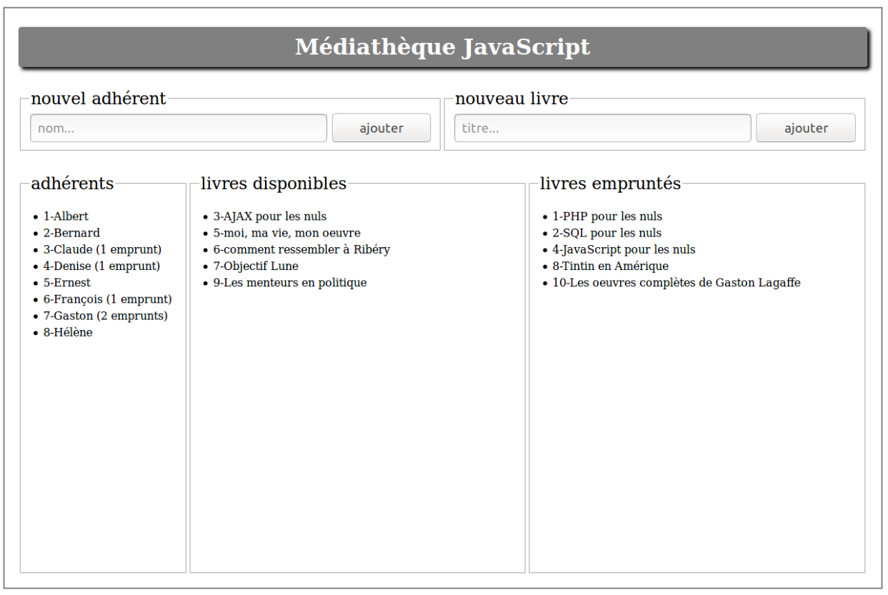
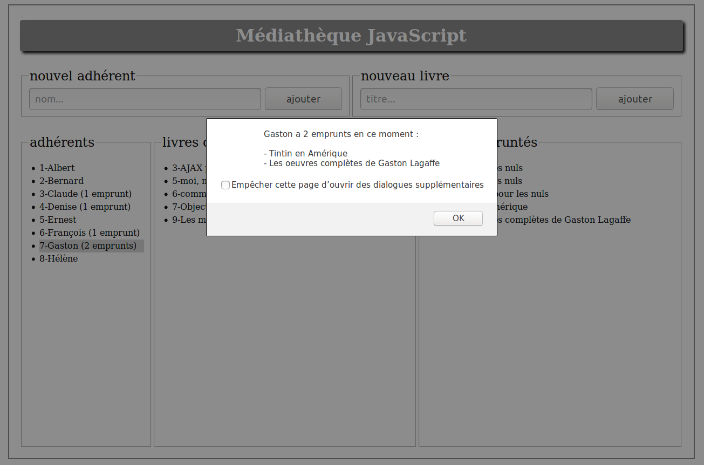
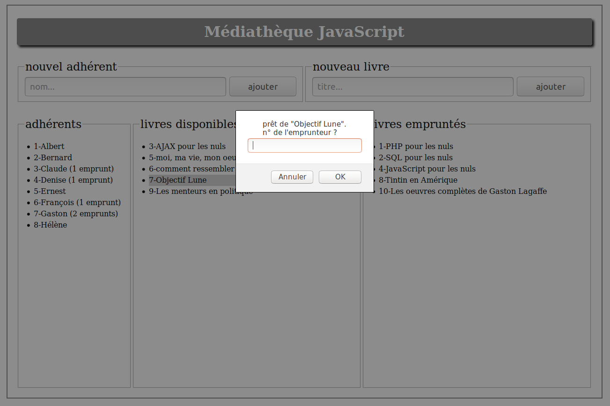
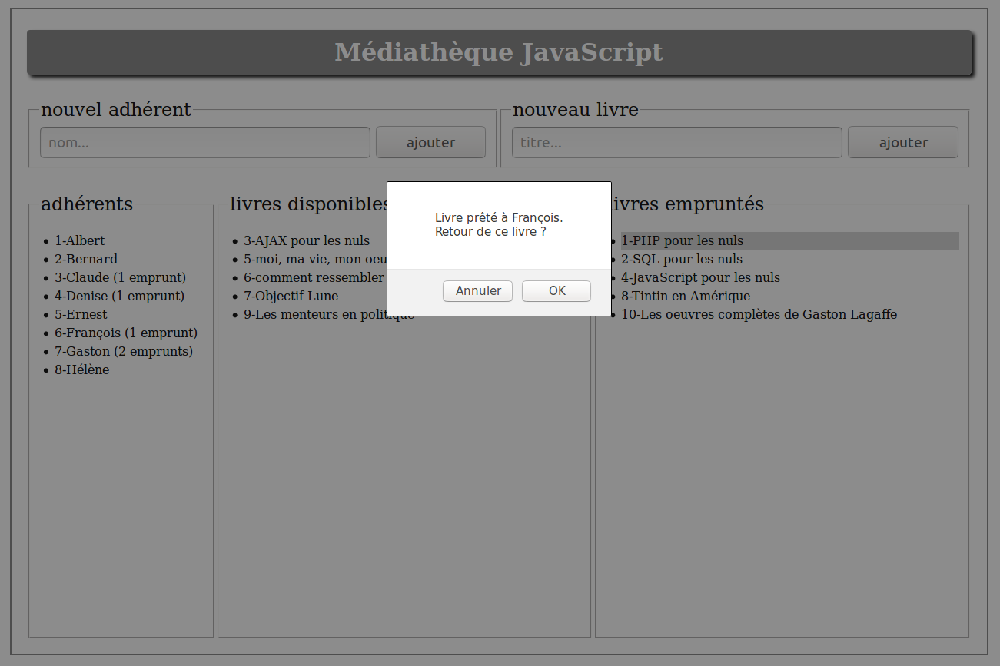
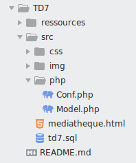

#  Prog web client riche - JavaScript

### IUT Montpellier-Sète – Département Informatique

## TD7
#### _Thème : AJAX, mise en place d'une application médiathèque_

Cliquez sur le lien ci-dessous pour faire, dans un dossier public_html/JS/TD7, votre fork privé du TD7 (**attention, pas de fork à la main !**):

https://classroom.github.com/a/vUQLDYzC

la version [pdf](ressources/td7.pdf)

## INTRODUCTION

**Ce TD7 est évalué et fait office de projet JavaScript.**

Vous pouvez travailler seul, ou bien en binôme. Vous devrez alimenter le dépôt github mais vous devrez aussi communiquer une adresse public_html testable pour que votre enseignant puisse évaluer les fonctionnalités programmées.

Pour ce travail vous allez devoir programmer le fonctionnement d’une mini-médiathèque. Vous aurez à gérer des adhérents, des livres et des emprunts.

L’idée essentielle est d’avoir une interaction souple avec la base de données par le biais de la technologie AJAX.

Vous disposez pour ce TD, d’une architecture de départ pour l’environnement web, avec les fichiers `mediatheque.html` et `styles.css`. Vous pouvez les modifier.

L’interface par défaut de la médiathèque ressemble à cette capture d’écran :

	

	capture d’écran 1 – affichage classique

## Fonctionnalités de base à développer

Cette application travaillera en lien avec une base de données que vous pourrez importer grâce au fichier `td7.sql`. Les entités `adherent` et `livre` sont matérialisées par des tables, ainsi que la relation `emprunt` entre un `adherent` et un `livre`.

Vous allez développer des fonctionnalités qui permettent de gérer les entrées et sorties de la médiathèque. Plus tard vous pourrez complexifier la base de données si vous souhaiter construire une médiathèque plus élaborée.

L’utilisateur de la médiathèque pourra au minimum :

+ enregistrer un nouvel adhérent ;
+ enregistrer un nouveau livre ;
+ disposer à tout moment, sous les yeux, des trois listes donnant les adhérents, les livres disponibles à l’emprunt, et les livres empruntés. La liste des adhérents permet de voir combien un adhérent emprunte de livres en ce moment ;
+ avoir accès, par un clic sur le nom de l’adhérent, à la liste des livres qu’il a en sa possession en ce moment ;
+ avoir accès, par un clic sur le titre du livre disponible à l’emprunt, à une fenêtre qui permet de prêter le livre à un adhérent ;
+ avoir accès, par un clic sur le titre du livre prêté, à une fenêtre proposant la restitution du livre.

Il est bien entendu que l’utilisateur récupère, à chaque nouvelle utilisation, l’état précédent de la médiathèque.

Chaque action modifiant la base de données occasionnera une mise à jour de l’interface. Voici quelques captures d’écran montrant les états possibles de la médiathèque en fonction des actions.

### capture d'écran – clic sur un adhérent

	

### capture d'écran – clic sur un livre disponible

	

### capture d'écran – clic sur un livre emprunté

	

## Conseils et Consignes

Structurez précisément votre architecture de fichiers. Exemple :

	

Produisez un code JavaScript propre avec des classes contenant les méthodes adéquates.

Même si ce n’est pas le thème principal, vous aurez à écrire un peu de PHP. Inspirez vous des TD précédents au besoin. Il est probable que vous ayez à :

+ enrichir `Model.php` de nouvelles fonctions requêtes ;
+ créer de nouveaux fichiers PHP produisant des `echo json_encode(...)`.
